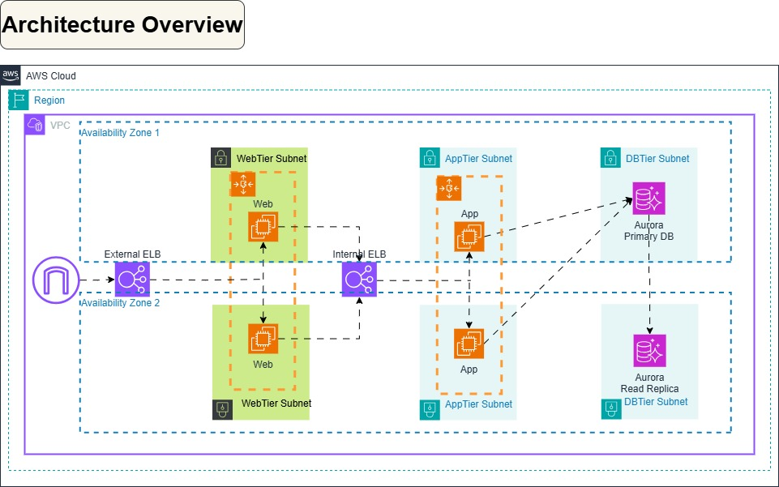

# Table of Contents
- Solution Overview
- Architecture Lab
- Architecture Diagram
- Deployment Steps

# Solution Overview
Deploy a simple web application on AWS using EC2 instances, ensuring high availability and scalability with Elastic Load Balancing (ALB) and Auto Scaling Groups (ASG). The project demonstrates best practices for compute scalability, security, and cost optimization.

**Key AWS Services Used:**
- **EC2:** Launch instances for the web app.
- **Application Load Balancer (ALB):** Distributes traffic across multiple instances.
- **Auto Scaling Group (ASG):** Ensures instances scale based on demand.
- **Amazon RDS (Optional):** Backend database (MySQL/PostgreSQL) with Multi-AZ.
- **IAM:** Role-based access to instances.
- **CloudWatch & SNS:** Monitor performance and send alerts.

**Learning Outcomes:**
- Setting up **secure and scalable** EC2-based web applications.
- Implementing **high availability** using ALB and ASG.
- Optimizing **costs and performance** using Auto Scaling policies.

# AWS Architecture Lab

This project demonstrates a scalable and secure AWS architecture designed for a web application. The architecture incorporates various AWS services to ensure high availability, fault tolerance, and security.

## Architecture Diagram



## Key Components 

|  Layer | Service Used |  Purpose  |
|----------|----------|-------------|  
| Frontend  | S3   |  Static hosting |
| Application | EC2(Auto Scaling), ALB | Dynamic scaling & Load balancing |
| Data | RDS (MySQL) | Managed Database |
| Security | IAM, Security Groups | Access Control |
| Monitoring | CloudWatch | Real-time alerts & Logging |

# Key Components Description

The architecture consists of the following components:

### Frontend Layer
- **S3**: Static website hosting for frontend assets

### Application Layer
- **EC2 Auto Scaling Group**: For horizontal scaling of application servers
- **Elastic Load Balancer (ALB)**: Distributes traffic across instances

### Data Layer
- **RDS (PostgreSQL)**: Managed relational database with Multi-AZ deployment
  
### Security
- **Security Groups & NACLs**: Network-level security
- **IAM**: Fine-grained access control

### Monitoring & Operations
- **CloudWatch**: Monitoring and logging
- **SNS**: Alert notifications

## Deployment Steps

1. **Set up VPC with public and private subnets**
   ```bash
   # Create VPC
   
      VPC_ID=$(aws ec2 create-vpc --cidr-block 10.0.0.0/16 --query 'Vpc.VpcId' --output text)
      aws ec2 modify-vpc-attribute --vpc-id $VPC_ID --enable-dns-support
      aws ec2 modify-vpc-attribute --vpc-id $VPC_ID --enable-dns-hostnames
   ```
   ```
   # Create Internet Gateway
   
     IGW_ID=$(aws ec2 create-internet-gateway --query 'InternetGateway.InternetGatewayId' --output text)
     aws ec2 attach-internet-gateway --vpc-id $VPC_ID --internet-gateway-id $IGW_ID
   ```
   ```
   # Create public and private subnets in AZ1 and AZ2

      PUB_SUBNET_AZ1=$(aws ec2 create-subnet --vpc-id $VPC_ID --cidr-block 10.0.1.0/24 --availability-zone us-east-1a --query 'Subnet.SubnetId' --output text)
      PUB_SUBNET_AZ2=$(aws ec2 create-subnet --vpc-id $VPC_ID --cidr-block 10.0.2.0/24 --availability-zone us-east-1b --query 'Subnet.SubnetId' --output text)

      WEB_SUBNET_AZ1=$(aws ec2 create-subnet --vpc-id $VPC_ID --cidr-block 10.0.3.0/24 --availability-zone us-east-1a --query 'Subnet.SubnetId' --output text)
      WEB_SUBNET_AZ2=$(aws ec2 create-subnet --vpc-id $VPC_ID --cidr-block 10.0.4.0/24 --availability-zone us-east-1b --query 'Subnet.SubnetId' --output text)

      APP_SUBNET_AZ1=$(aws ec2 create-subnet --vpc-id $VPC_ID --cidr-block 10.0.5.0/24 --availability-zone us-east-1a --query 'Subnet.SubnetId' --output text)
      APP_SUBNET_AZ2=$(aws ec2 create-subnet --vpc-id $VPC_ID --cidr-block 10.0.6.0/24 --availability-zone us-east-1b --query 'Subnet.SubnetId' --output text)

      DB_SUBNET_AZ1=$(aws ec2 create-subnet --vpc-id $VPC_ID --cidr-block 10.0.7.0/24 --availability-zone us-east-1a --query 'Subnet.SubnetId' --output text)
      DB_SUBNET_AZ2=$(aws ec2 create-subnet --vpc-id $VPC_ID --cidr-block 10.0.8.0/24 --availability-zone us-east-1b --query 'Subnet.SubnetId' --output text)
   ```
   ```
   # Create route table for public subnets

      PUB_RT=$(aws ec2 create-route-table --vpc-id $VPC_ID --query 'RouteTable.RouteTableId' --output text)
      aws ec2 create-route --route-table-id $PUB_RT --destination-cidr-block 0.0.0.0/0 --gateway-id $IGW_ID
      aws ec2 associate-route-table --route-table-id $PUB_RT --subnet-id $PUB_SUBNET_AZ1
      aws ec2 associate-route-table --route-table-id $PUB_RT --subnet-id $PUB_SUBNET_AZ2
   ```
2. **Configure security groups and NACLs**
   ```
    # Create security groups

       ELB_SG=$(aws ec2 create-security-group --group-name ExternalELB-SG --description "External ELB Security Group" --vpc-id $VPC_ID --query 'GroupId' --output text)
       WEB_SG=$(aws ec2 create-security-group --group-name WebTier-SG --description "Web Tier Security Group" --vpc-id $VPC_ID --query 'GroupId' --output text)
       APP_SG=$(aws ec2 create-security-group --group-name AppTier-SG --description "App Tier Security Group" --vpc-id $VPC_ID --query 'GroupId' --output text)
       DB_SG=$(aws ec2 create-security-group --group-name DBTier-SG --description "DB Tier Security Group" --vpc-id $VPC_ID --query 'GroupId' --output text)
   ```
   ```
    # Configure security group rules
      # External ELB SG
        aws ec2 authorize-security-group-ingress --group-id $ELB_SG --protocol tcp --port 80 --cidr 0.0.0.0/0
        aws ec2 authorize-security-group-ingress --group-id $ELB_SG --protocol tcp --port 443 --cidr 0.0.0.0/0

      # Web Tier SG
      aws ec2 authorize-security-group-ingress --group-id $WEB_SG --protocol tcp --port 80 --source-group $ELB_SG
      aws ec2 authorize-security-group-ingress --group-id $WEB_SG --protocol tcp --port 443 --source-group $ELB_SG
      aws ec2 authorize-security-group-ingress --group-id $WEB_SG --protocol tcp --port 22 --cidr <YOUR_IP_ADDRESS>/32

      # App Tier SG
      aws ec2 authorize-security-group-ingress --group-id $APP_SG --protocol tcp --port 8080 --source-group $WEB_SG
      aws ec2 authorize-security-group-ingress --group-id $APP_SG --protocol tcp --port 22 --source-group $WEB_SG

      # DB Tier SG
      aws ec2 authorize-security-group-ingress --group-id $DB_SG --protocol tcp --port 3306 --source-group $APP_SG
      aws ec2 authorize-security-group-ingress --group-id $DB_SG --protocol tcp --port 5432 --source-group $APP_SG
   ```  
3. **Deploy RDS database in private subnets**
   ```
   # Create DB Subnet Group
      aws rds create-db-subnet-group \
          --db-subnet-group-name aurora-subnet-group \
          --db-subnet-group-description "Aurora DB Subnet Group" \
          --subnet-ids $DB_SUBNET_AZ1 $DB_SUBNET_AZ2
   # Create Aurora DB Cluster
      aws rds create-db-cluster \
          --db-cluster-identifier my-aurora-cluster \
          --engine aurora-mysql \
          --engine-version 5.7.mysql_aurora.2.11.2 \
          --master-username admin \
          --master-user-password secret123 \
          --db-subnet-group-name aurora-subnet-group \
          --vpc-security-group-ids $DB_SG
   # Create Primary DB Instance
      aws rds create-db-instance \
          --db-instance-identifier my-aurora-primary \
          --db-cluster-identifier my-aurora-cluster \
          --engine aurora-mysql \
          --db-instance-class db.t3.medium \
          --availability-zone us-east-1a \
          --db-subnet-group-name aurora-subnet-group
   # Create Read Replica
      aws rds create-db-instance \
          --db-instance-identifier my-aurora-replica \
          --db-cluster-identifier my-aurora-cluster \
          --engine aurora-mysql \
          --db-instance-class db.t3.medium \
          --availability-zone us-east-1b \
          --db-subnet-group-name aurora-subnet-group \
          --source-db-instance-identifier my-aurora-primary
   ```
4. **Create EC2 launch template and Auto Scaling Group**
   ```
     # Create launch template for web tier
      aws ec2 create-launch-template \
          --launch-template-name web-tier-template \
          --version-description "Web tier launch template" \
          --launch-template-data '{
              "ImageId": "ami-0c55b159cbfafe1f0",
              "InstanceType": "t3.micro",
              "KeyName": "my-key-pair",
              "SecurityGroupIds": ["'$WEB_SG'"],
              "UserData": "'$(echo -e '#!/bin/bash\nyum update -y\nyum install -y httpd\nsystemctl start httpd\nsystemctl enable httpd' | base64)'",
              "TagSpecifications": [{
                  "ResourceType": "instance",
                  "Tags": [{"Key": "Name", "Value": "WebTier-Instance"}]
        }]
    }'

    # Create Auto Scaling Group for web tier
      aws autoscaling create-auto-scaling-group \
          --auto-scaling-group-name web-tier-asg \
          --launch-template "LaunchTemplateName=web-tier-template,Version=1" \
          --min-size 2 \
          --max-size 4 \
          --desired-capacity 2 \
          --vpc-zone-identifier "$WEB_SUBNET_AZ1,$WEB_SUBNET_AZ2" \
          --target-group-arns $WEB_TG_ARN
   ```
5. **Set up Application Load Balancer**
```
    # Create External ALB
      ALB_ARN=$(aws elbv2 create-load-balancer \
          --name external-alb \
          --subnets $PUB_SUBNET_AZ1 $PUB_SUBNET_AZ2 \
          --security-groups $ELB_SG \
          --scheme internet-facing \
          --type application \
          --query 'LoadBalancers[0].LoadBalancerArn' \
          --output text)

  # Create target group for web tier
    WEB_TG_ARN=$(aws elbv2 create-target-group \
        --name web-tier-tg \
        --protocol HTTP \
        --port 80 \
        --vpc-id $VPC_ID \
        --health-check-protocol HTTP \
        --health-check-path "/" \
        --health-check-interval-seconds 30 \
        --health-check-timeout-seconds 5 \
        --healthy-threshold-count 2 \
        --unhealthy-threshold-count 2 \
        --query 'TargetGroups[0].TargetGroupArn' \
        --output text)

  # Create listener for ALB
    aws elbv2 create-listener \
        --load-balancer-arn $ALB_ARN \
        --protocol HTTP \
        --port 80 \
        --default-actions Type=forward,TargetGroupArn=$WEB_TG_ARN
```
7. **Implement monitoring and alerts**
```
    # Create CloudWatch alarms for ASG
      aws cloudwatch put-metric-alarm \
          --alarm-name HighCPUWebTier \
          --alarm-description "Alarm when CPU exceeds 70 percent" \
          --metric-name CPUUtilization \
          --namespace AWS/EC2 \
          --statistic Average \
          --period 300 \
          --threshold 70 \
          --comparison-operator GreaterThanThreshold \
          --dimensions "Name=AutoScalingGroupName,Value=web-tier-asg" \
          --evaluation-periods 2 \
          --alarm-actions $(aws autoscaling put-scaling-policy \
              --policy-name ScaleOutPolicy \
              --auto-scaling-group-name web-tier-asg \
              --scaling-adjustment 1 \
              --adjustment-type ChangeInCapacity \
              --query 'PolicyARN' \
              --output text)

    # Create SNS topic for notifications
      SNS_TOPIC_ARN=$(aws sns create-topic --name InfrastructureAlerts --query 'TopicArn' --output text)
      aws sns subscribe --topic-arn $SNS_TOPIC_ARN --protocol email --notification-endpoint kyawswar141996@gmail.com
```


